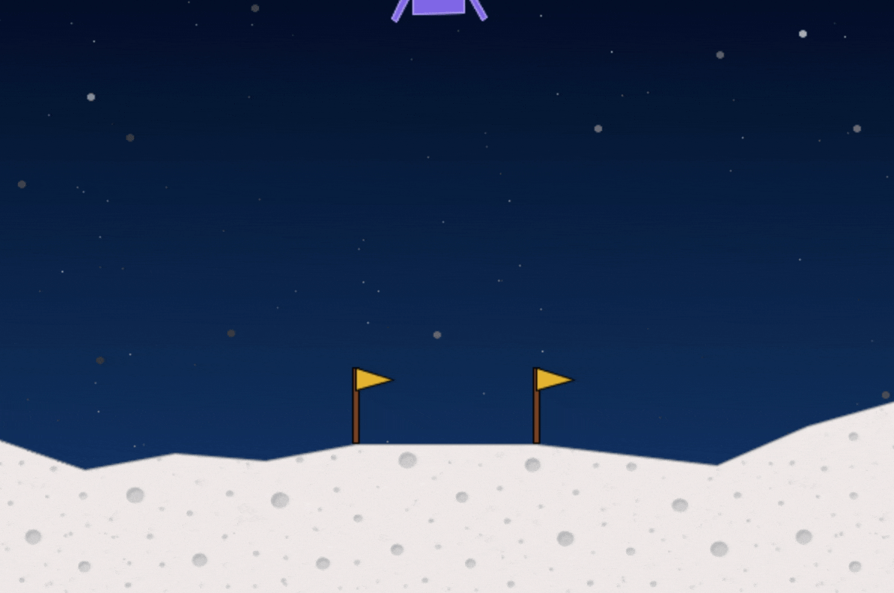
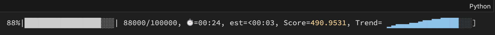

# HelloRL

Reinforcement Learning is usually confusing to get started, but HelloRL makes it quick and easy. It’s fully modular so you can upgrade your training once you’re ready for more, and even invent your own RL algorithms. Please ⭐ this repo if you find it useful.


### Why is RL usually so hard?
Reinforcement Learning is a family of ML algorithms (like Actor Critic, A2C, PPO etc.) designed for agents to learn from experience. These algorithms are all similar, but they also have unique implementation details and subtle differences. Every RL framework implements each algorithm from scratch, reproducing many of the same steps across hundreds of lines of code, but with minor implementation differences along the way.

Trying to swap between them and keep your code working can be a nightmare. If you want to experiment with a new idea on top of Actor Critic, and then try it on a PPO implementation, you would have to spend hours integrating, and hope you didn’t make a mistake. It's a minefield -- it's so easy to trip yourself up and get something wrong without realising.

## Introducing HelloRL
HelloRL flips this on its head, with **a single `train` function** and swappable modules, to build and mix together any RL algorithm easily.



**HelloRL**:
- A modular library for Reinforcement Learning
- Built around a single `train` function that covers every popular algorithm, from discrete online policies like Actor Critic, to continuous offline policies like TD3.
- Swap modules in and out to mix algorithms together. Go from online to offline learning with just a few easy changes. Follow along with the provided notebooks to make sure you got it right.
- Build your own custom modules and validate your ideas quickly.

## Features

- **Over 20 swappable modules**:
    - Actors: Discrete, Stochastic, Deterministic
    - Critics: Critic, QCritic
    - Agents: Agent, AgentWithTargets
    - RewardTransform: None, Scale
    - RolloutMethod: MonteCarlo, A2C
    - AdvantageMethod: Standard, GAE
    - AdvantageTransform: None, Normalize
    - DataLoadMethod: Single, Epochs, Replay
    - GradientTransform: None, ClipNorm
    - LearningRateSchedule: Constant, LinearAnneal
    - Critic Loss: Standard, Clipped, Q
    - PolicyObjective: Standard, Clipped
- Plus other configurable hyperparameters: policy delay, gamma, entropy coef, exploration std, tau
- Supports Discrete and Continuous outputs
- Supports online and offline training within the same loop
- Supports major RL algorithms, with sample implementations in notebooks:
    - Actor Critic
    - A2C
    - PPO
    - DDPG
    - TD3
- Supports OpenAI/Farama Gymnasium environments, particularly tested on CartPole and Lunar Lander, which the example notebooks demonstrate.
- Supports PyTorch.


## Extras


### Progress

Progress utility gives nice in-line training progress with a trend graph. It makes things a little bit more sophisticated than printing a line for every 1000 timesteps. It'll show up automatically when you run `trainer.train()`.



### Modal

You might run training and see good results, but then you run it again and things get worse. Is it because of something you changed, or just down to randomness? To find that out, you could run your training loop 100 times, and then compare your results, but this would be 100x slower and take hours!

Instead, you can use Modal, which lets you run hundreds of sessions at once, remotely on their machines. I’ve been using the free version, they give a $30 credit every month, and it’s covered me for all my CPU training.

They also have a cool dashboard so you can track everything, but our progress module also supports Modal runs, and gives live updates while the training runs happen remotely.

Modal simply needs to setup auth, one time. Run `modal setup` or `python -m modal setup` on the command line, within the project. [Here is more info](https://modal.com/docs/guide).

(I’m not affiliated with Modal. I am also not responsible if you run through your Modal credits or wrack up a bill.)


## Getting started with HelloRL

With UV or Pip:

```
uv add helloRL
```

or

```
pip install helloRL
```

Example of training Actor Critic:

```python
from helloRL import *

env_name = 'LunarLander-v3'
continuous = True
n_timesteps = 100000

env = gym.make(env_name, continuous=continuous)
state_dim = env.observation_space.shape[0]
action_dim = env.action_space.shape[0]
action_range = torch.tensor(np.stack([env.action_space.low, env.action_space.high]))

actor = StochasticActor(state_dim=state_dim, action_dim=action_dim, action_range=action_range)
critic = Critic(state_dim=state_dim)
agent = Agent(actor=actor, critics=[critic])
params = Params()

returns, lengths = trainer.train(agent, env_name, continuous, params, n_timesteps)
```

To upgrade from MonteCarlo to A2C rollout:

```python
params = Params(
    rollout_method=RolloutMethodA2C(n_steps=16, n_envs=4),

)

returns, lengths = trainer.train(agent, env_name, continuous, params, n_timesteps)
```

To add targets from DDPG (an offline algorithm with many other differences):

```python
agent_params = AgentWithTargetsParams(
    tau=0.005
)
agent = AgentWithTargets(actor=actor, critics=[critic], params=agent_params)
```

And so on...

You can see examples of how to implement each major algorithm within the /notebooks directory.

---

HelloRL is the first public release from [i10e](https://i10e.ai), a robot intelligence research lab based in London.

Built by Andrew Hart ([website](https://andrewhart.me) / [X](https://x.com/andrewhart)). 

Please star this repo ⭐ if you find it useful.

